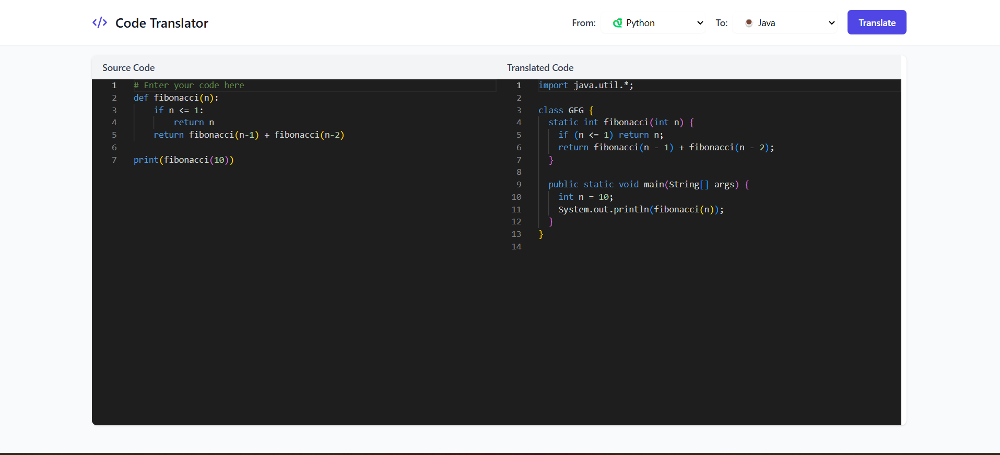

# Code-Translator




## Overview

The **Code-to-Code Translator** is an AI-powered tool that enables seamless translation of code between five major programming languages: Python, C++, Java, C#, and JavaScript. This project leverages the **CodeT5 model**, fine-tuned to accurately convert source code from one language to another while preserving functionality and coding standards.

## Features

- **Multi-Language Support**: Supports translation between Python, C++, Java, C#, and JavaScript.
- **Deep Learning-Powered**: Utilizes a fine-tuned **CodeT5** model for precise translations.
- **Separate Models for Each Language**: Five specialized models, each dedicated to translating one language to the other four.
- **Efficient Training Pipeline**: Trained using a structured dataset ensuring correct language conversion.
- **Web Integration**: Designed to be integrated into a web-based application for real-time code translation.
- **React Frontend with Vite & Tailwind CSS**: A modern, fast, and responsive web UI.
- **Flask Backend**: Manages API requests and model inference.

## Dataset

The dataset consists of code snippets in five programming languages with corresponding translations. Each entry ensures accurate language-to-language transformation without mixing different languages.

## Model Training

The model training pipeline involves:

1. **Preprocessing Data**: Cleaning and formatting code snippets.
2. **Fine-Tuning CodeT5**: Training separate models for each source language.
3. **Using Weights & Biases (wandb)**: Tracking experiments, managing artifacts, and saving models efficiently.
4. **Evaluation**: Measuring translation accuracy and performance.

## Installation & Setup

### Prerequisites

Ensure you have the following installed:

- Python 3.8+
- Flask
- PyTorch
- Hugging Face Transformers
- Weights & Biases (wandb)
- Node.js & npm (for frontend)

### Clone the Repository

```bash
git clone https://github.com/mrinal224/Code-Translator.git
cd Code-Translator
```

### Install Backend Dependencies

```bash
pip install -r requirements.txt
```

### Configure Weights & Biases (wandb)

```bash
wandb login
```

### Install Frontend Dependencies

```bash
npm install
```

### Training the Model


## Usage

### Running the Flask Server

```bash
python translator.py
```

The backend will be available at `http://localhost:5000`.

### Running the Frontend

```bash
npm run dev
```

The frontend will be available at the port specified by Vite (usually `http://localhost:5173`).

### Translating Code via API

Once the Flask server is running, you can send a request:

```bash
curl -X POST "http://localhost:5000/translate" -H "Content-Type: application/json" -d '{"code": "print(\"Hello, World!\")", "source_lang": "python", "target_lang": "java"}'
```

### Using the Web UI

1. Open `http://localhost:5173` in your browser.
2. Enter your code and select the source and target languages.
3. Click "Translate" to get the converted code.

## Future Enhancements

- Expand support to more programming languages.
- Improve model performance with additional training data.
- Enhance the web UI for better user experience.
- Deploy the application online.

## Contributing

Contributions are welcome! Feel free to open an issue or submit a pull request.

## License

This project is licensed under the MIT License - see the [LICENSE](LICENSE) file for details.

## Contact

For any queries, reach out at [[ucinovation2004@example.com](mailto:ucinovation2004@example.com)] or create an issue in the repository.

